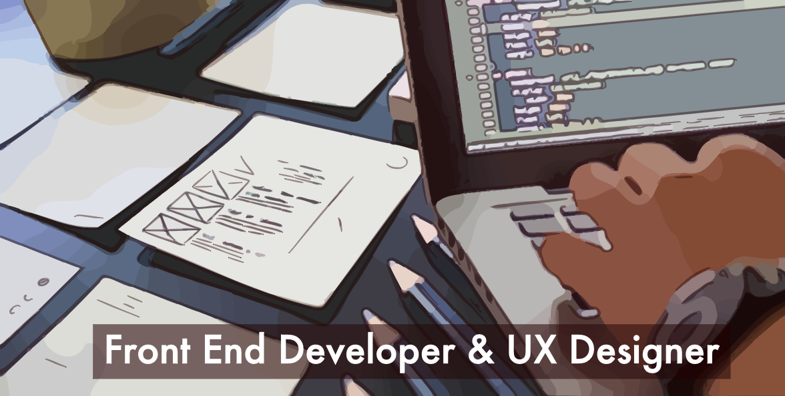
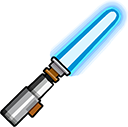

# Hello there! 
Mi name is ```John León``` and welcome to my GitHub profile 👋.

> Since 2013, I have been a professional with experience as Web UI Developer 👨‍💻 where I have been working  with programming languages such as: ```HTML, CSS, JavaScript and frameworks (or libraries)``` for every one. I program web apps ***from Web Layout to API's integration***, always working under agile methodologies like **SCRUM**. Also, I have certificates and some projects about UX design 🖼.

🎓 I'm Telematic Engineer

🏋️‍♂️ I'm constantly improving my tech skills

📚 Right now, I'm improving my english skills

🏎 I enjoy karting and F1 races

🛩 I like to travel around the world

🔭 I'm looking for new horizons


# 🥇 Technologies that I've used

### UI Design Tools


### Web Layout


### Front End


### Dev Tools


### AI Tools


### Others


# Projects

I am a passionate front-end software developer with a deep interest in applying the full tech stack to create dynamic web experiences. I work with HTML, CSS, and JavaScript, as well as frameworks like React, Angular, and Vue.js to build reactive and efficient interfaces. I use libraries like Redux for state management and tools like Webpack and npm to streamline development. I focus on optimizing performance and accessibility, ensuring fast and usable applications. Each project is an opportunity to translate designs into functional code, applying best practices and modern standards.

Some of the projects:

> ReactJS
- [Recetario bebidas](https://github.com/jleon253/recetario-bebidas)
- [Banco imagenes](https://github.com/jleon253/banco-imagenes)
- [Dr. Mascota](https://github.com/jleon253/dr-mascota)
> Angular 2+
- [Firechat](https://github.com/jleon253/my-firechat)
- [Pelis App](https://github.com/jleon253/pelis-app)
- [Youtube List videos](https://github.com/jleon253/my-youtube-api)
> VueJS
- [Lista tareas](https://github.com/jleon253/lista-tareas)
- [Libreta notas](https://github.com/jleon253/libreta-notas)
- [Compras](https://github.com/jleon253/compras-vue)
> JavaScript, SVG, Python
- [Studio Ghibli](https://github.com/jleon253/api-studio-ghibli)
- [SVG animation](https://github.com/jleon253/svg-animation)
- [Police attack prediction](https://github.com/jleon253/ml-police-attack-prediction)

# Check some of my stats

| *GitHub Stats* | *Programming Languages* |
---|---  
|  |  [](https://github-readme-stats.vercel.app/api/top-langs/?username=jleon253&layout=compact&theme=tokyonight) |


# 💻 Find me here too

- [Portfolio](https://www.behance.net/jleon253) where I share the user interface & look and feel of my past projects.
- [Linkedin](https://www.linkedin.com/in/jleon253/) where I share my curriculum with more details such as certificates and courses taken.


# Resources

Write an email or download mi CV.
- [jleon253@gmail.com](mailto:jleon253@gmail.com)
- [Curriculum](/_[CV%20Web%20UI%20Ssr%20Adv]%20John%20Edward%20Leon%20Muñoz%202024.pdf)
